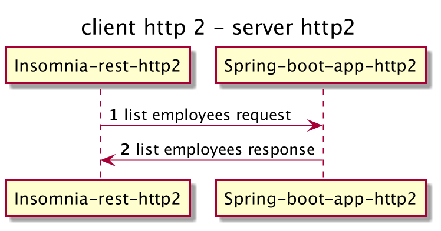
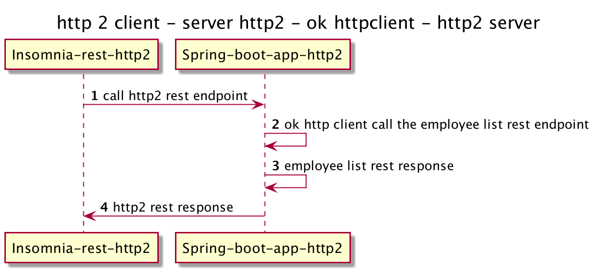

# spring-boot-http2

The application is related with sprint boot application with using undertow web server and http 2.

http2 is a binary protocol, you can get more detail information -> https://en.wikipedia.org/wiki/HTTP/2

# Http2 vs Http1.1

https://www.cloudflare.com/learning/performance/http2-vs-http1.1/

# The application tech stack

    Java11
    Spring Boot 2+
    Undertow 2+
    Gradle
    OkHttpClient 4+
    Log4j2
    Lombok
    H2 Db
    
    Docker 
      - build.sh
      - release.sh
    
    Insomnia.rest
    Plantuml    

# Add domain hosts file using vim or nano editor

    127.0.0.1 localhost turgay.dev
    
# Self-signed cert creation

    keytool -genkey -keyalg RSA -alias selfsigned -keystore secure.jks -storepass secret -validity 365
-- 


    What is your first and last name?
    [Unknown]:  turgay can
    What is the name of your organizational unit?
    [Unknown]:  turgay
    What is the name of your organization?
    [Unknown]:  turgay.dev
    What is the name of your City or Locality?
    [Unknown]:  istanbul
    What is the name of your State or Province?
    [Unknown]:  bakirkoy
    What is the two-letter country code for this unit?
    [Unknown]:  tr
    Is CN=turgay can, OU=turgay, O=turgay.dev, L=istanbul, ST=bakirkoy, C=tr correct?
    [no]:  yes

    Enter key password for <selfsigned>
    (RETURN if same as keystore password):  
    Re-enter new password:
---

password should be same as in the command "secret"

---

    keytool -certreq -alias selfsigned -keystore secure.jks -storepass secret -file turgay.dev.csr

https://documentation.commvault.com/commvault/v11/article?p=3714.htm

JKS -> Java Key Store 

PKCS12 came standard in the JDK with Java 9. Although I have used JKS within the application, I recommend using PKCS12.

https://en.wikipedia.org/wiki/PKCS_12

# OkHttpClient not validate certificates

https://stackoverflow.com/questions/25509296/trusting-all-certificates-with-okhttp

# OkHttpClient creates client pem file from self-signed server cert and validate certificates

https://jebware.com/blog/?p=340

Client certificate using via chrome browser. (if the browser cannot show the pem encoded chain, please configure the security level for a temporary time)

# Docker

**build.sh :** build a docker images via Dockerfile

**release.sh :** version the code and docker image tag and then push the local docker registry 

local docker registry

    docker run -d -p 5000:5000 --name registry registry:2

https://docs.docker.com/registry/

run docker container via image

    docker run -d -p 443:8443 --name springhttp2 localhost:5000/turgaycan.dev/spring-boot-http2:1.0.2


# Client tool - Insomnia.rest

https://insomnia.rest/

The application flow for testing

**test 1**



**request**

```javascript
curl--request GET \
--url https://turgay.dev/rest/v10/employees
```

**response**

```javascript
{
    "code": "OK",
        "description": "SUCCESSFUL",
        "employees": [
        {
            "id": 4,
            "fullname": "Muhammed Nursoy",
            "email": "muhammed@nursoy.com",
            "salary": 35100.14,
            "startDate": 1497042000000
        },
        {
            "id": 3,
            "fullname": "Fatih Bozik",
            "email": "fatih@bozik.com",
            "salary": 25000.14,
            "startDate": 1497042000000
        },
        {
            "id": 2,
            "fullname": "Serdar Kuzucu",
            "email": "serdar@kuzucu.com",
            "salary": 15000.37,
            "startDate": 1365541200000
        },
        {
            "id": 1,
            "fullname": "Turgay Can",
            "email": "turgay@can.com",
            "salary": 10000.61,
            "startDate": 1504126800000
        }
    ]
}
```
**Insomnia rest client timeline & http trace**

* Preparing request to https://turgay.dev/rest/v10/employees
* Current time is 2021-10-01T19:58:55.859Z
* Using libcurl/7.73.0 OpenSSL/1.1.1k zlib/1.2.11 brotli/1.0.9 zstd/1.4.9 libidn2/2.1.1 libssh2/1.9.0 nghttp2/1.42.0
* Using HTTP/2
* Disable timeout
* Enable automatic URL encoding
* Disable SSL validation
* Enable cookie sending with jar of 0 cookies
* Connection 1 seems to be dead!
* Closing connection 1
* TLSv1.3 (OUT), TLS alert, close notify (256):
* Found bundle for host turgay.dev: 0x7f98c71a4690 [can multiplex]
* Re-using existing connection! (#2) with host turgay.dev
* Connected to turgay.dev (127.0.0.1) port 443 (#2)
* Using Stream ID: 3 (easy handle 0x7f98c0920a00)

> GET /rest/v10/employees HTTP/2
> Host: turgay.dev
> user-agent: insomnia/2021.5.3
> accept: */*

< HTTP/2 200
< content-type: application/json
< date: Fri, 01 Oct 2021 19:58:55 GMT


* Received 480 B chunk
* Connection #2 to host turgay.dev left intact

--

**test 2**



**request**

```javascript
curl --request GET \
--url https://turgay.dev/rest/v10/http2
```
**response**

```javascript
{
  "code": "OK",
  "description": "SUCCESSFUL",
  "value": "request protocol : HTTP/2.0, example.com response : '{\"code\":\"OK\",\"description\":\"SUCCESSFUL\",\"employees\":[{\"id\":4,\"fullname\":\"Muhammed Nursoy\",\"email\":\"muhammed@nursoy.com\",\"salary\":35100.14,\"startDate\":1497042000000},{\"id\":3,\"fullname\":\"Fatih Bozik\",\"email\":\"fatih@bozik.com\",\"salary\":25000.14,\"startDate\":1497042000000},{\"id\":2,\"fullname\":\"Serdar Kuzucu\",\"email\":\"serdar@kuzucu.com\",\"salary\":15000.37,\"startDate\":1365541200000},{\"id\":1,\"fullname\":\"Turgay Can\",\"email\":\"turgay@can.com\",\"salary\":10000.61,\"startDate\":1504126800000}]}'"
}
```

**Insomnia rest client timeline & http trace**

* Preparing request to https://turgay.dev/rest/v10/http2
* Current time is 2021-10-01T20:53:49.290Z
* Using libcurl/7.73.0 OpenSSL/1.1.1k zlib/1.2.11 brotli/1.0.9 zstd/1.4.9 libidn2/2.1.1 libssh2/1.9.0 nghttp2/1.42.0
* Using HTTP 1.1
* Disable timeout
* Enable automatic URL encoding
* Disable SSL validation
* Enable cookie sending with jar of 0 cookies
* Found bundle for host turgay.dev: 0x7f98c7c826e0 [can multiplex]
* Re-using existing connection! (#3) with host turgay.dev
* Connected to turgay.dev (127.0.0.1) port 443 (#3)
* Using Stream ID: 4b (easy handle 0x7f98c30c4000)

> GET /rest/v10/http2 HTTP/2
> Host: turgay.dev
> user-agent: insomnia/2021.5.3
> accept: */*

< HTTP/2 200
< content-type: application/json
< date: Fri, 01 Oct 2021 20:53:49 GMT


* Received 651 B chunk
* Connection #3 to host turgay.dev left intact

# Performance Metrics

#Test environment
    Macbook Pro
    2,6 GHz 6-Core Intel Core i7
    16 GB 2400 MHz DDR4

    application java heap memory max : 1g

h2load tool
---

**h2load tool**

http1.1 client vs http2 client -> http2 server

# REST API

---

**test 1 result**

**scenario 1 :** request : 10000, concurrent client : 100, max concurrent stream : 10

#run1
http2 client : 13.29s, 752.26 req/s, 392.69KB/s

http1.1 client : 4.14s, 2415.58 req/s, 1.46MB/s

**scenario 2 :** request : 100000, concurrent client : 100, max concurrent stream : 10

#run2
http2 client : 127.19s, 786.23 req/s, 410.05KB/s

http1.1 client : 72.42s, 1380.90 req/s, 853.62KB/s

**test 2 result**

**scenario 3 :** request : 1000, concurrent client : 2, max concurrent stream : 10

#run3

http2 client : 386.04s, 2.59 req/s, 972B/s

http1.1 client : 11.92s, 83.91 req/s, 65.88KB/s


------ RESULTS DETAILS ------

**test 1**

#run 1

---
http2 client
---
    h2load -n10000 -c100 -m10 https://turgay.dev/rest/v10/http2
---

    starting benchmark...
    spawning thread #0: 100 total client(s). 10000 total requests
    TLS Protocol: TLSv1.3
    Cipher: TLS_AES_128_GCM_SHA256
    Server Temp Key: ECDH P-256 256 bits
    Application protocol: h2
    progress: 10% done
    progress: 20% done
    progress: 30% done
    progress: 40% done
    progress: 50% done
    progress: 60% done
    progress: 70% done
    progress: 80% done
    progress: 90% done
    progress: 100% done
    
    finished in 13.29s, 752.26 req/s, 392.69KB/s
    requests: 10000 total, 10000 started, 10000 done, 10000 succeeded, 0 failed, 0 errored, 0 timeout
    status codes: 10000 2xx, 0 3xx, 0 4xx, 0 5xx
    traffic: 5.10MB (5345400) total, 264.84KB (271200) headers (space savings 61.80%), 4.58MB (4800000) data
    min         max         mean         sd        +/- sd
    time for request:   364.65ms       2.28s       1.17s    392.99ms    72.84%
    time for connect:   239.25ms       1.34s    808.99ms    332.17ms    61.00%
    time to 1st byte:   600.84ms       2.20s       1.63s    342.39ms    59.00%
    req/s           :       7.52        8.86        7.90        0.33    67.00%

----
http1.1 client
---
    h2load -n10000 -c100 -m10 --h1 https://turgay.dev/rest/v10/http2
---

    starting benchmark...
    spawning thread #0: 100 total client(s). 10000 total requests
    TLS Protocol: TLSv1.3
    Cipher: TLS_AES_128_GCM_SHA256
    Server Temp Key: ECDH P-256 256 bits
    Application protocol: http/1.1
    progress: 10% done
    progress: 20% done
    progress: 30% done
    progress: 40% done
    progress: 50% done
    progress: 60% done
    progress: 70% done
    progress: 80% done
    progress: 90% done
    progress: 100% done
    
    finished in 4.14s, 2415.58 req/s, 1.46MB/s
    requests: 10000 total, 10000 started, 10000 done, 10000 succeeded, 0 failed, 0 errored, 0 timeout
    status codes: 10000 2xx, 0 3xx, 0 4xx, 0 5xx
    traffic: 6.04MB (6330000) total, 1.00MB (1050000) headers (space savings 0.00%), 4.58MB (4800000) data
    min         max         mean         sd        +/- sd
    time for request:   112.06ms    850.56ms    328.51ms     89.74ms    91.10%
    time for connect:   336.33ms       1.13s    695.51ms    205.90ms    62.00%
    time to 1st byte:      1.11s       1.51s       1.24s     91.28ms    66.00%
    req/s           :      24.16       26.64       25.14        0.61    61.00%

#run 2

----
http2 client
---
    h2load -n100000 -c100 -m10 https://turgay.dev/rest/v10/http2
---

    starting benchmark...
    spawning thread #0: 100 total client(s). 100000 total requests
    TLS Protocol: TLSv1.3
    Cipher: TLS_AES_128_GCM_SHA256
    Server Temp Key: ECDH P-256 256 bits
    Application protocol: h2
    progress: 10% done
    progress: 20% done
    progress: 30% done
    progress: 40% done
    progress: 50% done
    progress: 60% done
    progress: 70% done
    progress: 80% done
    progress: 90% done
    progress: 100% done
    
    finished in 127.19s, 786.23 req/s, 410.05KB/s
    requests: 100000 total, 100000 started, 100000 done, 100000 succeeded, 0 failed, 0 errored, 0 timeout
    status codes: 100000 2xx, 0 3xx, 0 4xx, 0 5xx
    traffic: 50.93MB (53405413) total, 2.58MB (2701200) headers (space savings 61.95%), 45.78MB (48000000) data
    min         max         mean         sd        +/- sd
    time for request:    92.27ms       3.48s       1.24s    354.08ms    77.35%
    time for connect:   371.16ms       2.26s       1.19s    636.93ms    63.00%
    time to 1st byte:   848.67ms       3.41s       2.12s    812.16ms    56.00%
    req/s           :       7.86        8.22        7.94        0.09    85.00%

----
http1.1 client
---
    h2load -n100000 -c100 -m10 --h1 https://turgay.dev/rest/v10/http2
---

    starting benchmark...
    spawning thread #0: 100 total client(s). 100000 total requests
    TLS Protocol: TLSv1.3
    Cipher: TLS_AES_128_GCM_SHA256
    Server Temp Key: ECDH P-256 256 bits
    Application protocol: http/1.1
    progress: 10% done
    progress: 20% done
    progress: 30% done
    progress: 40% done
    progress: 50% done
    progress: 60% done
    progress: 70% done
    progress: 80% done
    progress: 90% done
    progress: 100% done
    
    finished in 72.42s, 1380.90 req/s, 853.62KB/s
    requests: 100000 total, 100000 started, 100000 done, 100000 succeeded, 0 failed, 0 errored, 0 timeout
    status codes: 100000 2xx, 0 3xx, 0 4xx, 0 5xx
    traffic: 60.37MB (63300000) total, 10.01MB (10500000) headers (space savings 0.00%), 45.78MB (48000000) data
    min         max         mean         sd        +/- sd
    time for request:    24.54ms       2.90s    708.90ms    282.28ms    78.62%
    time for connect:   333.81ms       2.18s       1.18s    659.95ms    62.00%
    time to 1st byte:      2.95s       3.75s       3.31s    245.45ms    61.00%
    req/s           :      13.81       14.11       13.88        0.06    81.00%
------

**test 2**

    curl --request GET \
    --url https://turgay.dev/rest/v10/http2

#run 3

----
http2 client
----
    h2load -n1000 -c2 -m10 https://turgay.dev/rest/v10/http2
---
    starting benchmark...
    spawning thread #0: 2 total client(s). 1000 total requests
    TLS Protocol: TLSv1.3
    Cipher: TLS_AES_128_GCM_SHA256
    Server Temp Key: ECDH P-256 256 bits
    Application protocol: h2
    progress: 10% done
    progress: 20% done
    progress: 30% done
    progress: 40% done
    progress: 50% done
    progress: 60% done
    progress: 70% done
    progress: 80% done
    progress: 90% done
    progress: 100% done
    
    finished in 386.04s, 2.59 req/s, 972B/s
    requests: 1000 total, 1000 started, 1000 done, 405 succeeded, 595 failed, 0 errored, 0 timeout
    status codes: 405 2xx, 0 3xx, 0 4xx, 595 5xx
    traffic: 366.68KB (375478) total, 26.39KB (27024) headers (space savings 61.94%), 313.84KB (321370) data
    min         max         mean         sd        +/- sd
    time for request:    32.32ms      20.26s       7.72s       5.02s    69.00%
    time for connect:    46.27ms     46.93ms     46.60ms       467us   100.00%
    time to 1st byte:   100.28ms      10.18s       5.14s       7.13s   100.00%
    req/s           :       1.30        1.30        1.30        0.00   100.00%

----
http1.1 client
----
    h2load -n1000 -c2 -m10 --h1 https://turgay.dev/rest/v10/http2
---    
    starting benchmark...
    spawning thread #0: 2 total client(s). 1000 total requests
    TLS Protocol: TLSv1.3
    Cipher: TLS_AES_128_GCM_SHA256
    Server Temp Key: ECDH P-256 256 bits
    Application protocol: http/1.1
    progress: 10% done
    progress: 20% done
    progress: 30% done
    progress: 40% done
    progress: 50% done
    progress: 60% done
    progress: 70% done
    progress: 80% done
    progress: 90% done
    progress: 100% done
    
    finished in 11.92s, 83.91 req/s, 65.88KB/s
    requests: 1000 total, 1000 started, 1000 done, 1000 succeeded, 0 failed, 0 errored, 0 timeout
    status codes: 1000 2xx, 0 3xx, 0 4xx, 0 5xx
    traffic: 785.16KB (804000) total, 102.54KB (105000) headers (space savings 0.00%), 635.74KB (651000) data
    min         max         mean         sd        +/- sd
    time for request:   118.72ms    334.45ms    235.53ms     45.52ms    68.00%
    time for connect:    67.23ms     78.32ms     72.77ms      7.85ms   100.00%
    time to 1st byte:   349.19ms    396.89ms    373.04ms     33.73ms   100.00%
    req/s           :      41.96       42.44       42.20        0.34   100.00%


# Static Page

Loading...

